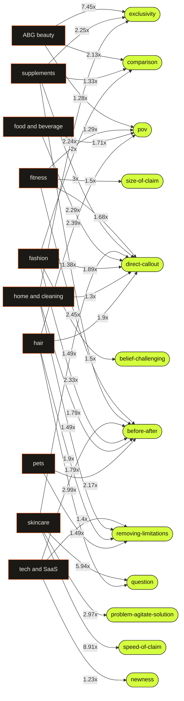

# ABG CMO — decoded insights wiki

Auto-generated from 4,475 real short-form videos decoded by the pipeline. This is derived analysis (no source video content). Regenerate with `node pipeline/build-wiki.mjs`.

## The connection map

Which hook patterns over-perform in which niches. A pattern wired to several niches is a cross-niche winner; a pattern unique to one niche is a niche-specific edge. (Edge labels = lift among breakouts.)

## Cross-niche winners (the commonalities)

Hook patterns that over-index among breakouts in more than one niche:

- **[direct-callout](patterns/direct-callout.md)** wins in 7 niches: fitness, supplements, skincare, food and beverage, fashion, home and cleaning, hair
- **[before-after](patterns/before-after.md)** wins in 6 niches: fitness, supplements, tech and SaaS, fashion, home and cleaning, pets
- **[pov](patterns/pov.md)** wins in 5 niches: ABG beauty, fitness, skincare, food and beverage, hair
- **[removing-limitations](patterns/removing-limitations.md)** wins in 5 niches: tech and SaaS, fashion, home and cleaning, hair, pets
- **[exclusivity](patterns/exclusivity.md)** wins in 3 niches: ABG beauty, supplements, home and cleaning
- **[comparison](patterns/comparison.md)** wins in 3 niches: ABG beauty, supplements, fashion
- **[belief-challenging](patterns/belief-challenging.md)** wins in 2 niches: fitness, fashion
- **[speed-of-claim](patterns/speed-of-claim.md)** wins in 2 niches: supplements, skincare
- **[question](patterns/question.md)** wins in 2 niches: skincare, hair

## What wins overall

- **humor** — 2x more common in breakouts (n=10)
- **direct-callout** — 1.48x more common in breakouts (n=288)
- **exclusivity** — 1.38x more common in breakouts (n=38)
- **before-after** — 1.35x more common in breakouts (n=270)
- **pov** — 1.24x more common in breakouts (n=123)

## Niches

- [ABG beauty](niches/abg-beauty.md) — 633 videos decoded
- [fitness](niches/fitness.md) — 432 videos decoded
- [supplements](niches/supplements.md) — 420 videos decoded
- [skincare](niches/skincare.md) — 398 videos decoded
- [food and beverage](niches/food-and-beverage.md) — 481 videos decoded
- [tech and SaaS](niches/tech-and-saas.md) — 487 videos decoded
- [fashion](niches/fashion.md) — 425 videos decoded
- [home and cleaning](niches/home-and-cleaning.md) — 461 videos decoded
- [hair](niches/hair.md) — 296 videos decoded
- [pets](niches/pets.md) — 442 videos decoded

## Hook patterns

- [exclusivity](patterns/exclusivity.md)
- [comparison](patterns/comparison.md)
- [pov](patterns/pov.md)
- [before-after](patterns/before-after.md)
- [direct-callout](patterns/direct-callout.md)
- [size-of-claim](patterns/size-of-claim.md)
- [belief-challenging](patterns/belief-challenging.md)
- [speed-of-claim](patterns/speed-of-claim.md)
- [question](patterns/question.md)
- [problem-agitate-solution](patterns/problem-agitate-solution.md)
- [removing-limitations](patterns/removing-limitations.md)
- [newness](patterns/newness.md)

---
_Method: a model labels each video's real spoken hook; engagement is normalized by follower count (over-performance, not raw views); patterns are mined by contrastive lift (breakouts vs the rest). See [../mcp/pipeline/README.md](../mcp/pipeline/README.md)._
