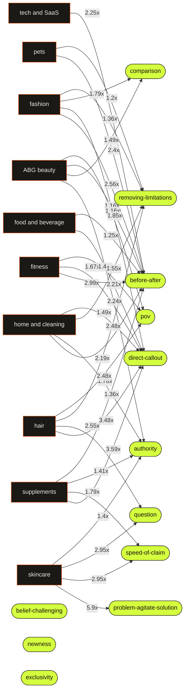

# ABG CMO — decoded insights wiki

Auto-generated from 3,839 real short-form videos decoded by the pipeline. This is derived analysis (no source video content). Regenerate with `node pipeline/build-wiki.mjs`.

## The connection map

Which hook patterns over-perform in which niches. A pattern wired to several niches is a cross-niche winner; a pattern unique to one niche is a niche-specific edge. (Edge labels = lift among breakouts.)

## Cross-niche winners (the commonalities)

Hook patterns that over-index among breakouts in more than one niche:

- **[before-after](patterns/before-after.md)** wins in 8 niches: ABG beauty, fitness, supplements, food and beverage, tech and SaaS, fashion, home and cleaning, pets
- **[direct-callout](patterns/direct-callout.md)** wins in 6 niches: fitness, supplements, food and beverage, fashion, home and cleaning, hair
- **[removing-limitations](patterns/removing-limitations.md)** wins in 5 niches: supplements, fashion, home and cleaning, hair, pets
- **[authority](patterns/authority.md)** wins in 4 niches: ABG beauty, supplements, skincare, home and cleaning
- **[pov](patterns/pov.md)** wins in 3 niches: ABG beauty, fitness, hair
- **[comparison](patterns/comparison.md)** wins in 2 niches: ABG beauty, fashion
- **[speed-of-claim](patterns/speed-of-claim.md)** wins in 2 niches: supplements, skincare
- **[question](patterns/question.md)** wins in 2 niches: skincare, hair

## What wins overall

- **before-after** — 1.48x more common in breakouts (n=242)
- **direct-callout** — 1.43x more common in breakouts (n=291)
- **exclusivity** — 1.43x more common in breakouts (n=34)
- **pov** — 1.18x more common in breakouts (n=149)
- **newness** — 1.17x more common in breakouts (n=160)

## Niches

- [ABG beauty](niches/abg-beauty.md) — 570 videos decoded
- [fitness](niches/fitness.md) — 347 videos decoded
- [supplements](niches/supplements.md) — 335 videos decoded
- [skincare](niches/skincare.md) — 399 videos decoded
- [food and beverage](niches/food-and-beverage.md) — 397 videos decoded
- [tech and SaaS](niches/tech-and-saas.md) — 396 videos decoded
- [fashion](niches/fashion.md) — 400 videos decoded
- [home and cleaning](niches/home-and-cleaning.md) — 399 videos decoded
- [hair](niches/hair.md) — 196 videos decoded
- [pets](niches/pets.md) — 400 videos decoded

## Hook patterns

- [authority](patterns/authority.md)
- [comparison](patterns/comparison.md)
- [before-after](patterns/before-after.md)
- [pov](patterns/pov.md)
- [direct-callout](patterns/direct-callout.md)
- [speed-of-claim](patterns/speed-of-claim.md)
- [removing-limitations](patterns/removing-limitations.md)
- [problem-agitate-solution](patterns/problem-agitate-solution.md)
- [question](patterns/question.md)
- [belief-challenging](patterns/belief-challenging.md)
- [newness](patterns/newness.md)
- [exclusivity](patterns/exclusivity.md)

---
_Method: a model labels each video's real spoken hook; engagement is normalized by follower count (over-performance, not raw views); patterns are mined by contrastive lift (breakouts vs the rest). See [../mcp/pipeline/README.md](../mcp/pipeline/README.md)._
